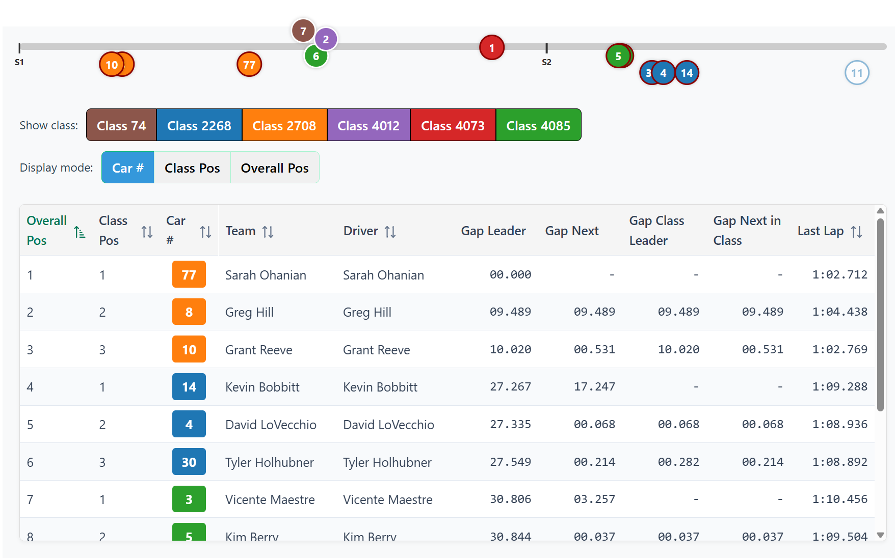

# iRemoteEngineer

iRemoteEngineer is a tool to follow, analyze and plan your races in iRacing. Launch the server app on the device of driver that's currently racing and enjoy variety of tools in any place in the world through your browser.

### Tools on offer

* standings and in-real time tracker

* fuel calculator

* current weather monitoring

* tyre data

* event tracker

* remote pit settings

### How to run?

Todo

### License

Todo