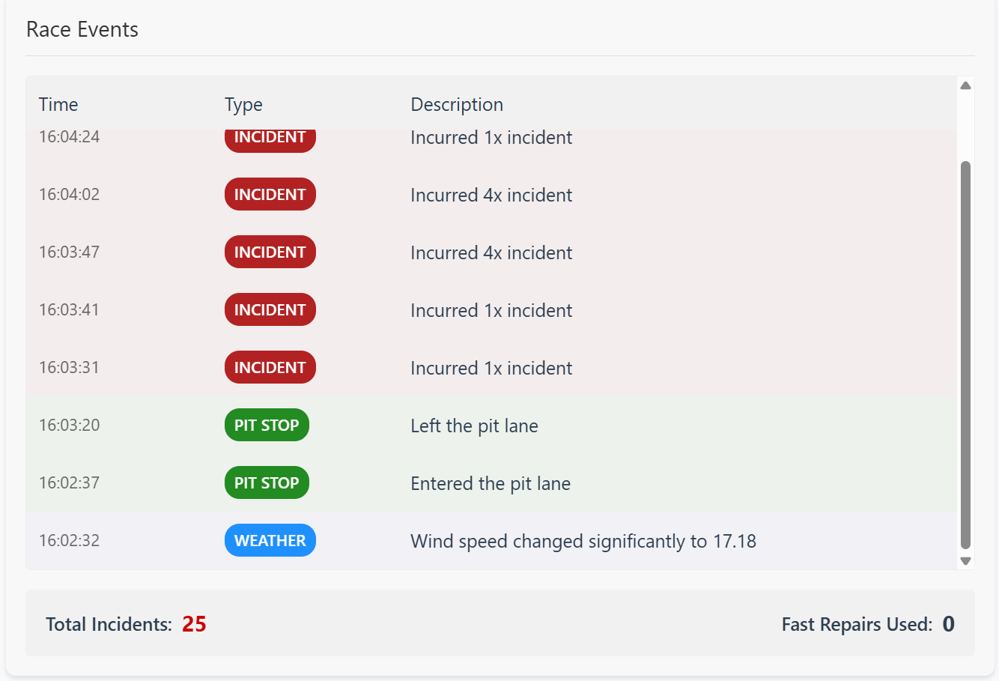

# iRemoteEngineer

iRemoteEngineer is a tool to follow, analyze and plan your races in iRacing. Launch the server app on the device of driver that's currently racing and enjoy variety of tools in any place in the world through your browser.

    

### How to use 

1. Download the [latest release](https://github.com/matto0O/iRemoteEngineer/releases). Make sure to keep *_internal* in the same directory as the app itself.
2. Launch the app.
3. Set your ngrok authentication token in *Settings* tab. Create your free ngrok account [here](https://dashboard.ngrok.com/signup).
4. Configure all the intervals of data transfer - the more often the data changes, the more internet may be consumed. 
5. If you want to see how the tool looks, select *Start test server*. Otherwise, if you have your iRacing session running, select *Start server*.  **Warning**: Your firewall / antivirus *may* block the app, as it exposes your iRacing data to the internet. If you deny the internet access, you will be only able to run the UI within your local network. For those of you that are concerned about the dangers of it (rightly so), the code is fully public.
6. Once the server is running, you will get a server URL address to connect to in step 5. Also, a console may appear. I am working to fix it, but for now, please, don't close it as it shuts down the server.
7. Launch the [UI service](https://iremoteengineer.onrender.com/) in your device of choice - same or different PC, mobile phone or a tablet. Once on the page, enter the URL you got in your server app and hit *Connect*.
8. Remember to set Max Cars to 63 to gather data about all the cars on the track. You can find it in iRacing graphic settings:

    

9. Enjoy all the data widgets available.

### Tools on offer

* standings and in-real time tracker

    

* fuel calculator

    

* current weather monitoring

    

* tyre data

    

* event tracker

    

* remote pit settings

    

