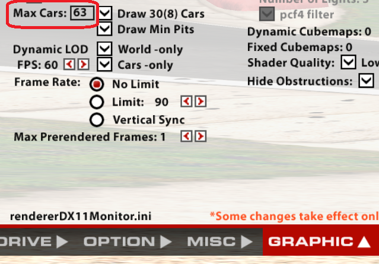
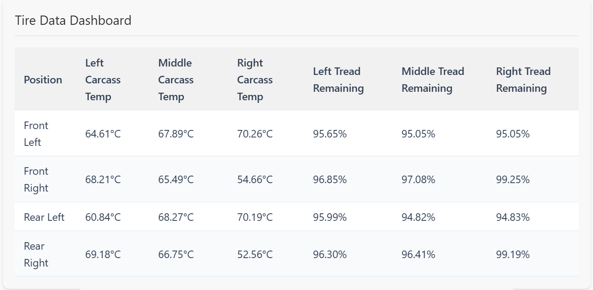

# iRemoteEngineer

iRemoteEngineer is a tool to follow, analyze and plan your races in iRacing. Launch the server app on the device of driver that's currently racing and enjoy variety of tools in any place in the world through your browser.

    

### How to use 

1. Download the [latest release](https://github.com/matto0O/iRemoteEngineer/releases) to stream the data to the dashboards.
2. Launch the app and personalize your data streaming experience with various settings.
3. Remember to set Max Cars to 63 in iRacing to gather data about all the cars on the track. You can find it in iRacing graphic settings:

    

4. Start a lobby using a unique name or stream to an already existing one (take it over from a friend finishing their stint?).
5. Launch the [UI service](http://iremoteengineer.s3-website.eu-north-1.amazonaws.com/) in your device of choice - same or different PC, mobile phone or a tablet. Once on the page, find your lobby and become a remote engineer.

### Tools on offer
New updates have also introduced several __Quality of life__ features - personalize your experience with __dark mode__, many toggles, __filters__, __sorting__ possibilities.

* standings and in-real time tracker and car highlighting

    

* fuel calculator

    

* current weather monitoring

    

* lap history

    

* tyre data

    

* event tracker

    

* remote pit settings

    

